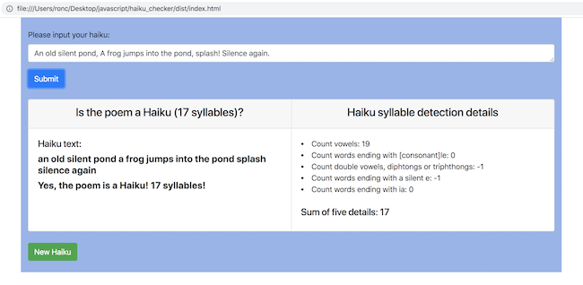
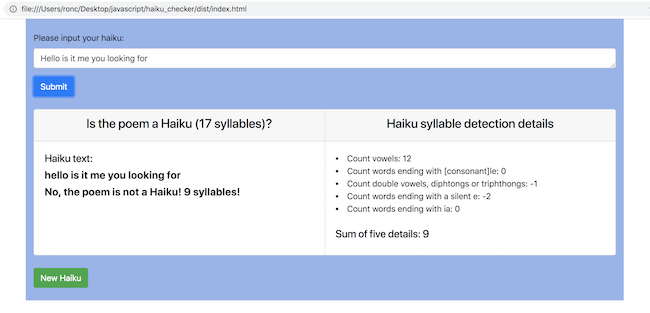

# haiku_checker

## An app to check if a poem is a haiku (17 syllables).

<kbd></kbd>

<kbd></kbd>

## Epicodus two day project: started 03/14-15/2018

## GitHub repository: https://github.com/r-craig73/haiku_checker

#### By Ron Craig (https://github.com/r-craig73) & Hamza Naeem (https://github.com/hamzilitary)

## Description
#### Epicodus lesson - Practicing Test Driven Development using Jasmine to write the test specs and Karma to run the specs.  The specs checks whether a poem is a haiku.

## List of specs passing
1. Count number of words in the haiku.
2. Syllable detection by 2 or more consonants next to each other.
3. Be able to count vowels for each word.
4. Be able to count vowels and consonants pairs.
5. Be able to count double vowels, diphthongs or triphthongs as one syllable.
6. Be able to count the number of times a word ends with 'e' & triphthongs cases ending in 'our' and 'ire'.
7. Be able to count the number of times a word ends with 'ia'.
8. Be able to count the number of times a word ends with [consonant] 'le'.
9. Be able to count the number of times a word contains double consonants that makes a sound.
10. Make sure the haiku contains 17 syllables (sum of specs 1, 5, 6, 7 & 8).
11. Return a phrase to tell a user if the poem is a Haiku ('Yes/No, the poem is/is not a Haiku! xx syllables!').

### Sources for haiku and syllable detection
#### http://jzimba.blogspot.com/2017/07/an-algorithm-for-counting-syllables.html (interesting rules)
#### The consonant surrounded by vowels https://www.howmanysyllables.com/divideintosyllables

## Application Setup
* Clone the repository
* In the home directory, install webpack and npm `$ npm install`

## Running the application
* In the home directory, build the code by running `$ npm run build`
* Open `haiku_checker/dist/index.html` in a Chrome browser to run the application
* ~~Or...~~
* ~~In the home directory, run `$ npm start build`.  Webpack will automatically start a development server in a web browser at http://localhost:8080/. Updates in the application will be saved instantly.~~  Not working!

## Testing setup
* Clone the repository
* In the home directory, run `$ npm test`
* View the opened Chrome browser (or copy the URL from the terminal) to view the passing/failing specs

## Issues
* Application will not verify the American haiku format (5-7-5 three lines)
* No function to separate combined words like `whitecap`
* No functions detecting difficult American words
* Webpack issue running `$ npm start build`. "ERROR in multi (webpack)-dev-server/client?http://localhost:8080 build
Module not found: Error: Can't resolve 'build' in '.../haiku_checker'
 @ multi (webpack)-dev-server/client?http://localhost:8080 build main[1]"
 

## Technologies Used
* HTML
* JavaScript
* Webpack and npm
* Jasmine
* Karma

## MIT License

#### Copyright (c) 2018 _Ron Craig & Hamza Naeem_
